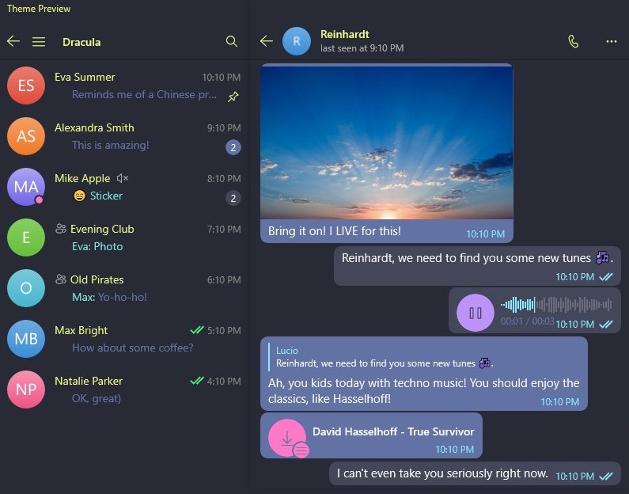

# Dracula for [Unigram](https://github.com/UnigramDev/Unigram)

> A dark theme for [Unigram](https://github.com/UnigramDev/Unigram).

## Install

All instructions can be found at [draculatheme.com/unigram](https://draculatheme.com/unigram).

## Team

This theme is maintained by the following person(s) and a bunch of [awesome contributors](https://github.com/dracula/unigram/graphs/contributors).

|  |  |
| ---------------------------------------------------------------------------------------- | ----------------------------------------------------------------------------------------- |
| [Zeno Rocha](https://github.com/zenorocha)                                               | [Adil Akhmetov](https://github.com/weeebdev)                                              |

## License

[MIT License](./LICENSE)
